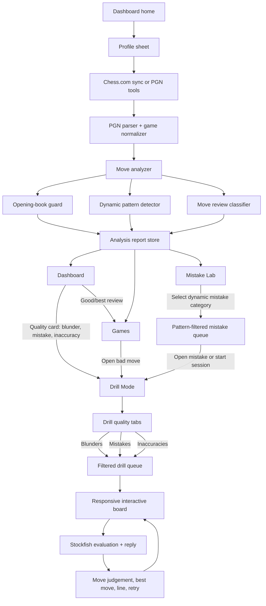

# Pattern Coach Design Walkthrough

## Product Goal

Pattern Coach is a chess training app that turns a player's own games into interactive drills. The app should feel closer to chess.com analysis and Lotus Chess training than a static report. The core promise is:

Analyze my games, find the mistakes and recurring patterns I actually make, then let me play through those positions against an engine until I understand them.

The app should not behave like a generic puzzle site. It should train from the user's mistakes, opening choices, tactical habits, king safety problems, and missed defensive resources.

## Core User Flow

1. The user lands on the dashboard.
2. The user opens profile from the top-right avatar and connects a Chess.com username.
3. The app syncs public Chess.com games or analyzes PGN from profile tools.
4. The app analyzes the games and detects recurring mistake patterns.
5. The dashboard shows a compact skill profile and the most important mistake themes.
4. The user opens the mistake lab to inspect individual positions.
5. The user enters drill mode.
6. Drill mode presents positions from the user's real games.
7. The user plays moves directly on the board.
8. The app checks the move using chess logic, opening theory, and Stockfish.
9. The engine replies, so the user can train the full position rather than just guess one move.
10. The user repeats positions until the pattern becomes familiar.

## App Architecture Flow



Presentation rules:

- Dashboard answers "what happened in my games?"
- Games answers "show me every game and every reviewed move."
- Mistake Lab answers "what happened in this exact mistake, and what did the engine punish?"
- Drill Mode answers "how do I train the repeated habits from my own mistakes?"
- Sync always imports all public Chess.com time controls; time-control filtering happens in Games and Mistake Lab after analysis.
- The chess board is shared infrastructure and must size to its container, never to the outer browser window.

## Screen: Import And Analysis

The first screen should be functional, not a marketing landing page.

Primary controls:

- Chess.com username
- Month range
- Game cap
- Time-control filters in Games and Mistake Lab, not during sync
- Import button
- PGN upload
- PGN paste area
- Load sample button

Design intent:

- Quiet, focused, utilitarian.
- The import controls should feel like a professional chess tool.
- Avoid decorative hero sections or oversized explanatory text.
- The board visual can act as a subtle chess signal, but the user should immediately understand that the app is for analysis and training.

## Screen: Dashboard

The dashboard should summarize the analysis without becoming a static training plan.

Key sections:

- Top metrics: games, moves, patterns, estimated rating.
- Focus area: the most recurring or severe mistake theme.
- Position lens: an interactive chess board showing the selected mistake position.
- Skill profile: tactical, positional, opening, endgame, blunder control, king safety, piece coordination, conversion.
- Move quality distribution.
- Pattern cards.
- Mistake lab.
- Games with training signal.

Important design note:

The old "training plan" section should not return. The app should teach through interactive positions, not generic advice like "solve 10 puzzles daily."

## Screen: Mistake Lab

The mistake lab is the bridge between analysis and training.

It should show:

- The selected mistake theme.
- A category dropdown built from detected patterns in the user's imported games.
- A game dropdown for all games or a specific game.
- A quality filter for all, blunders, mistakes, and inaccuracies.
- A queue of specific mistakes from real games.
- Move number and SAN.
- Pattern title.
- Severity score.
- Opening or game context where available.

Behavior:

- Clicking a mistake opens a detail page inside Mistake Lab.
- The detail page has its own board and engine context.
- The board shows the position before the mistake, not after.
- The user can switch between before, played, and consequence positions.
- The detail page shows the user's move, engine suggestion, engine reply, and line.
- The detail page includes game context such as opponent, time class, date, phase, and opening when available.
- The detail page shows Stockfish evaluation before and after the user's move.
- "Practice Here" keeps the user inside Mistake Lab and uses the same board/engine context.
- The user should be able to visually inspect what they missed.
- This area should make the user think, "I recognize this kind of position."

## Screen: Drill Mode

Drill mode is the most important part of the app.

It should feel like playing chess inside the app, not clicking an answer in a quiz.

Required behavior:

- Show a real chess board.
- Include a category selector so the user can choose all mistakes or any detected recurring pattern directly from Drill Mode.
- Training queues should be source-based: personal mistakes first, then future similar-position databases for the same pattern.
- Do not cap the queue at an arbitrary number like 50. The trainer should use the full filtered set, then later schedule it with spaced repetition.
- Allow natural piece selection.
- Show legal move dots.
- Show capture indicators.
- Highlight selected squares.
- Highlight last move.
- Flip board based on player color.
- Accept legal moves only.
- Let the user play against the engine.
- Evaluate the user's move.
- Let the engine reply.
- Allow reset, previous, next, and show best move.

Feedback states:

- Idle: waiting for the user to move.
- Thinking: engine is evaluating.
- Theory: the move is known opening theory.
- Correct: the move matches the engine's preferred solution or solves the mistake pattern.
- Wrong: the move does not solve the concrete problem.
- Engine reply: the engine has played back and the user can continue.

## Chess Logic Principles

The app must not judge every move only by shallow Stockfish top move.

Correct judgement order:

1. Is the move legal?
2. Is this an opening position with known theory?
3. Is the move a known book move or accepted variation?
4. Does the move solve the original mistake pattern?
5. What does Stockfish recommend?
6. If the engine disagrees, is it a small preference or a concrete tactical/refutation issue?

Example:

In the Italian Game, after:

```text
1. e4 e5 2. Nf3 Nc6 3. Bc4 Nf6
```

White's `Ng5` is a known theoretical move in the Two Knights Defense. The app must not call it wrong simply because Black has forcing replies. Some openings are sharp by design.

## Opening Knowledge

The app needs an opening-book layer.

Initial openings to support well:

- Italian Game
- Two Knights Defense
- Fried Liver Attack
- Giuoco Piano
- Ruy Lopez
- Scotch Game
- Queen's Gambit
- London System
- Sicilian Defense
- French Defense
- Caro-Kann
- King's Indian structures
- Common beginner traps and anti-traps

The opening book does not need to replace Stockfish. It should prevent false negatives and give human chess context.

## Mistake Pattern Examples

The app should identify and train recurring patterns such as:

- Weakening the castled king.
- Missing opponent threats.
- Allowing kingside attacks after castling.
- Moving pawns in front of the king without a concrete reason.
- Ignoring checks, captures, and threats.
- Leaving pieces loose.
- Missing forcing moves.
- Delaying castling.
- Re-moving opening pieces too often.
- Bringing the queen out too early.
- Failing to simplify when ahead.
- Passive king in the endgame.

Example user pattern:

The user castles kingside, then allows the opponent to build a kingside attack. The app should collect examples where the opponent's pieces or pawns attack the castled king, then create defensive drills from those positions.

## Board Interaction Design

The board is central to the product and should feel industry standard.

Expected details:

- Pieces should be clear and high contrast.
- Board colors should be calm and readable.
- Square coordinates should be visible but subtle.
- Legal move indicators should be familiar.
- Captures should be visually distinct from quiet moves.
- Last move should be highlighted.
- Best move arrows should be optional and clear.
- The board should not feel decorative; it is the primary work surface.

Do not overload the board area with text. Keep the board large and readable.

## Visual Direction

Overall tone:

- Professional chess training tool.
- Calm, focused, slightly premium.
- More chess.com analysis board than marketing dashboard.

Avoid:

- Decorative hero sections.
- Generic cards everywhere.
- One-note color palettes.
- Large motivational copy.
- Static training-plan content.
- UI text that explains obvious controls.

Prefer:

- Dense but organized layouts.
- Clear hierarchy.
- Strong board presence.
- Tool-like controls.
- Compact metadata.
- Engine and theory feedback near the board.

## Future UI Tweaks To Explore

- Add a left rail for modes: Analyze, Mistake Lab, Drill, Play Engine.
- Make the board and feedback panel the main split view.
- Add a move list beside the board.
- Add engine evaluation bar.
- Add opening name and variation badge above the board.
- Add "why this is a mistake" expandable explanation.
- Add "train this pattern" buttons from every pattern card.
- Add session progress by pattern type.
- Add spaced repetition for repeated mistakes.
- Add a dedicated "King safety" training queue.

## North Star

The app should answer:

"What mistakes do I keep making, and can I train the exact positions until I stop making them?"

Every design and engineering decision should support that.
