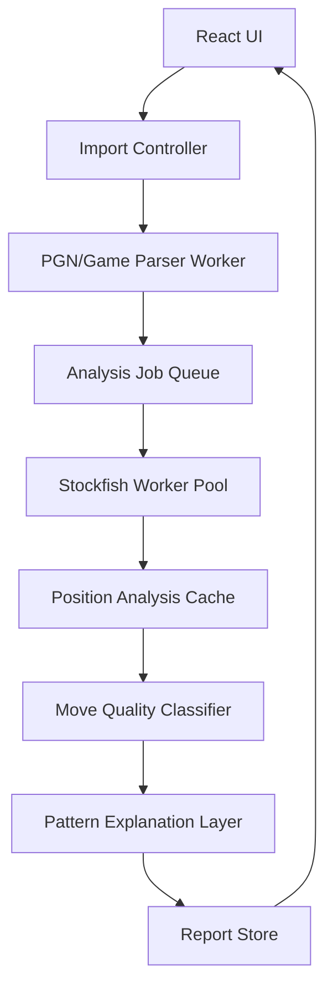

# Engine-Backed Analysis Architecture

## Goal

Replace heuristic-first move labeling with a deterministic engine-backed analysis pipeline that can classify mistakes, missed tactics, opening exceptions, and training positions from real centipawn or mate changes.

The current app should keep lightweight heuristics only as metadata and pattern explanations. The engine becomes the source of truth for move quality.

## Product Outcomes

- Every reviewed move has an engine-backed `bestMove`, played-move evaluation, centipawn loss, MultiPV alternatives, and confidence level.
- Pattern labels explain why a move was bad, but do not decide whether it was bad.
- Training drills judge user answers against the same engine analysis used in the report.
- Imports remain responsive for large Chess.com archives through background workers, cached analysis, progress events, and cancellation.
- Analysis is resumable and reproducible: the same PGN plus same engine settings yields the same report.

## System Shape



## Core Data Model

`AnalyzedMove`

```ts
type AnalyzedMove = {
  id: string;
  gameId: number;
  ply: number;
  moveNumber: number;
  color: "white" | "black";
  san: string;
  uci: string;
  fenBefore: string;
  fenAfter: string;
  phase: Phase;
  opening?: string;
  engine: {
    depth: number;
    nodes?: number;
    bestMove: string;
    playedMove: string;
    evalBefore: NormalizedEval;
    evalAfter: NormalizedEval;
    evalLossCp: number;
    multipv: EngineLine[];
    confidence: "book" | "high" | "medium" | "low" | "timeout" | "failed";
  };
  quality: MoveReviewQuality;
  patterns: PatternFinding[];
};
```

`NormalizedEval`

```ts
type NormalizedEval = {
  cp?: number;       // Always from White's perspective.
  mate?: number;    // Positive means White mates, negative means Black mates.
  wdl?: { win: number; draw: number; loss: number };
};
```

Store evaluations from White's perspective everywhere. Convert to player perspective only at display/classification boundaries. This prevents the sign bugs that happen when side-to-move and White-perspective scores are mixed.

## Engine Service

Use a dedicated `EnginePool` module rather than calling Stockfish from React hooks.

- `EnginePool` owns N workers, usually `navigator.hardwareConcurrency - 1` capped at 2 or 3 in-browser.
- Each worker has a strict request lifecycle: `uci`, options, `isready`, `ucinewgame` when needed, `position`, `go depth|movetime`, `bestmove`.
- Each request has an id, timeout, abort signal, and final result contract.
- Results are never inferred from partial PV unless timeout occurs; if timeout occurs, the result is marked `confidence: "timeout"` and `bestMove` falls back to PV line 1.
- Worker crashes reject the active request, recycle the worker, and surface a user-visible engine error.

Recommended API:

```ts
type AnalyzePositionRequest = {
  fen: string;
  depth: number;
  multipv: number;
  timeoutMs: number;
  signal?: AbortSignal;
};

type EngineService = {
  analyzePosition(request: AnalyzePositionRequest): Promise<EngineEvaluation>;
  analyzeMovePair(request: {
    fenBefore: string;
    playedUci: string;
    depth: number;
    multipv: number;
    signal?: AbortSignal;
  }): Promise<MoveEngineResult>;
};
```

## Analysis Pipeline

1. Parse PGNs into normalized games.
2. Reconstruct every move with `fenBefore`, `fenAfter`, SAN, UCI, headers, time class, result, rating.
3. Use the opening book first. If the move is known book and within early opening plies, label confidence as `book`; optionally skip deep engine unless user enables "deep opening audit".
4. For every non-book player move, request `analyzeMovePair`.
5. Cache each `fenBefore` engine result by `hash(engineVersion, depth, multipv, fen)`.
6. Compute `evalLossCp` from player perspective:

```ts
playerBefore = scoreForColor(evalBefore, playerColor);
playerAfter = scoreForColor(evalAfter, playerColor);
evalLossCp = max(0, playerBefore - playerAfter);
```

7. Classify move quality from loss, mate changes, and confidence.
8. Run pattern explainers only after quality is known.
9. Aggregate report metrics from `AnalyzedMove`, not raw heuristic issue counts.

## Move Quality Rules

Initial thresholds:

- `best`: played move equals engine best or loss <= 15 cp.
- `good`: loss <= 50 cp.
- `inaccuracy`: loss <= 120 cp.
- `mistake`: loss <= 250 cp.
- `blunder`: loss > 250 cp or converts a non-losing position into forced mate.
- `miss`: played move is acceptable or mildly bad, but MultiPV shows a forcing best move that wins >= 180 cp or changes mate status.

Mate rules override centipawns:

- Missing mate in 1-3 is at least `miss`.
- Allowing mate in 1-3 is `blunder`.
- Escaping forced mate should be `best` even if centipawn math looks strange.

## Pattern Explanation Layer

Pattern detectors should answer: "What kind of mistake was this?" not "Was this a mistake?"

Inputs:

- `AnalyzedMove`
- legal moves from `fenBefore`
- MultiPV lines
- material/piece activity deltas
- king safety features
- opening verdict

Examples:

- `missedForcingMove`: engine best is check/capture/threat, played move loses >= threshold versus best.
- `twoMoveBlindspot`: opponent's engine reply after the played move is forcing and accounts for most of the eval loss.
- `loosePiece`: eval loss correlates with a newly undefended piece that appears in engine PV.
- `kingShelter`: eval loss occurs after pawn moves around a castled king and engine PV exploits that side.
- `conversion`: player was materially or positionally winning, but move increases opponent counterplay or fails to trade into a stable advantage.

Every pattern gets:

```ts
type PatternFinding = {
  id: PatternId;
  confidence: number; // 0..1
  severity: number;   // derived from evalLossCp plus tactical/mate context
  evidence: string[];
};
```

## Caching and Persistence

Use IndexedDB for browser persistence.

Stores:

- `reports`: report metadata and summary.
- `games`: normalized PGN/game records.
- `moves`: analyzed move records.
- `positions`: engine evaluations keyed by engine settings and FEN.

Cache key:

```ts
sha256(`${engineName}:${engineVersion}:${depth}:${multipv}:${fen}`)
```

Cache invalidation:

- Bump `engineVersion` when Stockfish binary changes.
- Bump `analysisSchemaVersion` when classification logic changes.
- Allow "reanalyze at deeper depth" to create parallel cached records.

## Concurrency and Responsiveness

- Parsing runs in a parser worker.
- Engine analysis runs in an engine worker pool.
- Aggregation runs in an analysis coordinator worker.
- UI receives progress events:

```ts
type AnalysisProgress =
  | { type: "parsed"; games: number; moves: number }
  | { type: "engine"; done: number; total: number; current?: string }
  | { type: "classified"; done: number; total: number }
  | { type: "complete"; reportId: string };
```

Cancellation:

- Top-level `AbortController` aborts parser, queue, active engine requests, and report aggregation.
- Aborted jobs save partial cache entries only if the engine result is complete.

## UI Integration

Dashboard:

- Show "engine-backed" confidence and depth.
- Separate "book", "engine reviewed", and "heuristic only" badges.

Mistake Lab:

- Sort by `evalLossCp`, not heuristic severity alone.
- Display evidence: "lost 214 cp", "engine reply: ...", "missed best: ...".

Drills:

- Use stored `AnalyzedMove.engine.multipv`.
- Accept alternatives only if within configurable margin, e.g. 50 cp.
- If the user chooses a new move not in MultiPV, run a quick on-demand `analyzeMovePair`.

Analysis Board:

- Use the same `EngineService`, not a separate hook-level singleton.
- Show depth/confidence and timeout/failure states.

## Testing Strategy

Unit tests:

- eval sign normalization
- mate normalization
- quality thresholds
- opening book exact SAN matching
- pattern evidence builders
- drill alternative acceptance margin

Integration tests:

- sample PGN analysis produces stable report snapshot
- engine worker timeout returns PV fallback with `confidence: "timeout"`
- abort terminates active workers and leaves no unresolved promises
- cached second run avoids duplicate engine calls

Golden fixtures:

- missed mate
- allowed mate
- equal capture that loses queen
- book Sicilian pawn moves
- conversion position while up material
- queenless middlegame that is not a true endgame

## Migration Plan

Phase 1: Extract services

- Move current Stockfish singleton into `src/engine/EngineService.ts`.
- Move worker orchestration out of React hooks.
- Define `EngineEvaluation`, `MoveEngineResult`, and normalized eval helpers.

Phase 2: Engine-backed move review

- Add `analyzeMovePair`.
- Update worker pipeline to analyze each player move.
- Keep old heuristics only as pattern explainers.

Phase 3: Persistence and resume

- Add IndexedDB cache.
- Add analysis job ids, progress events, abort/resume.

Phase 4: UI confidence and drill consistency

- Show depth, loss, confidence.
- Make drills use stored engine records.
- Add on-demand deeper analysis button.

Phase 5: Calibration

- Tune thresholds with fixtures and real games.
- Add "fast", "balanced", and "deep" analysis modes.
- Compare engine-backed labels against Chess.com accuracy where available.

## Key Implementation Risks

- Browser CPU saturation: cap workers and expose lower-depth mode.
- Battery/mobile performance: default to fewer workers and lower depth on mobile.
- Engine binary failures: require explicit UI error states and retry.
- Misleading low-depth tactics: show confidence and allow reanalysis.
- Cache bloat: expire old position rows by least-recently-used policy.

## Definition of Done

- Every move label can cite engine evidence or book evidence.
- No pattern issue can downgrade a move without engine-supported loss.
- Analysis can be cancelled without leaked workers.
- Re-running the same PGN produces stable move labels.
- Drill answers are judged by the same engine data shown in Mistake Lab.
